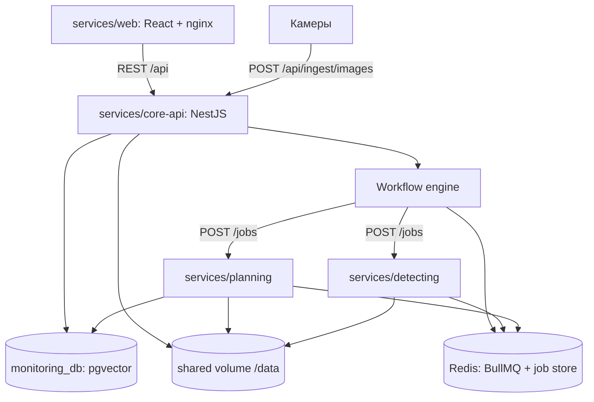
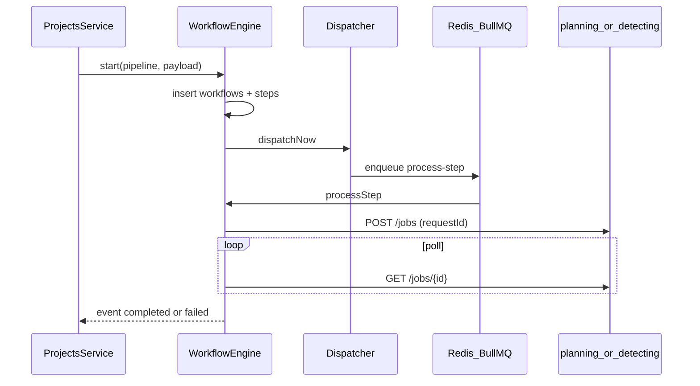
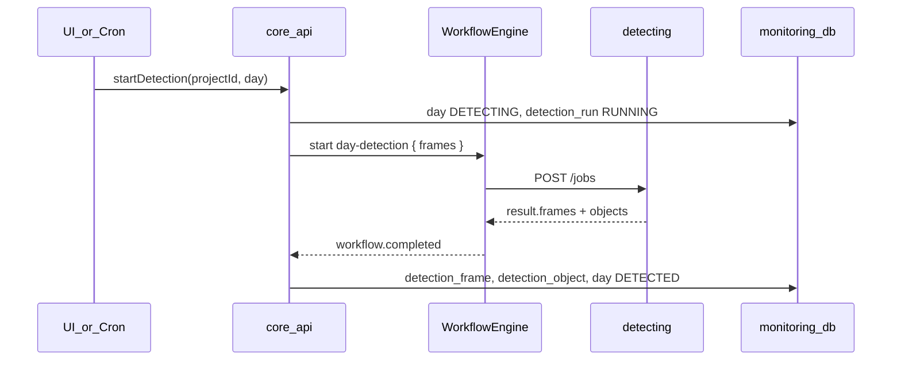

# Архитектура системы мониторинга строительной площадки

Документ описывает **текущее** устройство платформы: сервисы, данные, пайплайны и границы системы.
Краткий старт и контракт ingest — в [README.md](README.md).

## 1. Обзор

Система ведёт строительный **проект** от загрузки календарного плана до отчёта детекции по дням:

1. Создаётся проект (заказчик, адрес, таймзона, ingest-токен для камер).
2. Загружается версия календарного плана (`.mpp` / `.xml`) → импорт и сопоставление работ с нормами ГЭСН.
3. Кадры приходят с камер (ingest) или загружаются вручную и раскладываются по **дням**.
4. По дню запускается детекция (вручную или ночным cron) → нормализованный отчёт с боксами в UI.

**Осознанно не сделано:** сервис анализа нарушений. В UI есть вкладка-заглушка «В разработке»; отдельных таблиц и API под неё нет.

Стек по ролям:

| Слой | Технология |
| --- | --- |
| UI | Vite + React + Gravity UI + Tailwind (`services/web`) |
| Домен + оркестрация | NestJS 11 + TypeORM + BullMQ (`services/core-api`) |
| Импорт плана | FastAPI + MPXJ/JPype + embeddings/rerank (`services/planning`) |
| Детекция | FastAPI + YOLO / YOLO-World / DINOv2 (`services/detecting`) |
| БД | одна Postgres `monitoring_db` с pgvector |
| Очереди / кэш job-ов | Redis |
| Файлы | общий том `./shared` → `/data` |

## 2. Диаграмма компонентов



- **core-api** — единственная точка домена и HTTP для UI/камер. Workflow-движок внутри того же процесса, без HTTP между «доменом» и «оркестратором».
- **planning** и **detecting** — асинхронные job-сервисы с одинаковым контрактом; planning ещё пишет в Postgres, detecting работает с файлами на `/data` и отдаёт JSON-результат.
- **web** не ходит в Python-сервисы напрямую: nginx проксирует `/api` и `/health` в core-api.

## 3. Структура репозитория

```text
.
├── services/
│   ├── web/           # клиент (Vite), образ nginx
│   ├── core-api/      # NestJS: домен + workflow
│   ├── planning/      # FastAPI: импорт и классификация плана
│   └── detecting/     # FastAPI: детекция на кадрах
├── deploy/db/
│   ├── db.yml         # сервис Postgres для compose
│   └── migrations/    # SQL-миграции 001…016 (накатывает core-api)
├── scripts/           # seed, тонкие CLI над planning, утилиты
├── shared/            # том данных (в контейнерах — /data)
├── docker-compose.yml
├── Makefile           # up, down, logs, seed, reset
├── pyproject.toml     # extras: detecting, planning, calendar, seed
├── .env.example
├── README.md
└── ARCHITECTURE.md    # этот файл
```

Python-пакеты ищутся в `services/` (`detecting*`, `planning*`). Скрипты в `scripts/` ставятся через extras `seed` / `calendar` и при необходимости импортируют `planning`.

## 4. Runtime (Docker Compose)

Определения: [docker-compose.yml](docker-compose.yml), БД — [deploy/db/db.yml](deploy/db/db.yml). Подъём: `make up`.

| Сервис | Порт | Healthcheck | Зависимости | Тома |
| --- | --- | --- | --- | --- |
| `db` | 5432 | `pg_isready` | — | `monitoring_db_data` |
| `redis` | 6379 | `PING` | — | `redis-data` (AOF) |
| `detecting` | 8000 | `GET /health` | redis | `./shared:/data`, weights, cache |
| `planning` | 8001 | `GET /health` | db, redis | `./shared:/data`, cache |
| `core-api` | 3000 | `GET /health` | db, redis, detecting, planning | `./shared:/data`, migrations `:ro` |
| `web` | 8080→80 | nginx | core-api | — |

Внутренние URL пайплайнов (из [services/core-api/config/pipeline.json](services/core-api/config/pipeline.json)):

- planning: `http://planning:8001`
- detecting: `http://detecting:8000`

`make reset` — `compose down -v` и очистка `shared/projects`, `shared/workflows`, `shared/.idempotency`.

## 5. core-api

Исходники: [services/core-api/src](services/core-api/src).

### Bootstrap

- [main.ts](services/core-api/src/main.ts): глобальный префикс `api`, исключение `health`; CORS; лимит тела 25 MB; ValidationPipe.
- [app.module.ts](services/core-api/src/app.module.ts): TypeORM после миграций (`synchronize: false`), BullMQ, Schedule, EventEmitter, `WorkflowsModule`, `ProjectsModule`, `StorageModule`.

### Модули

| Модуль | Назначение |
| --- | --- |
| `projects` | Проекты, планы, сопоставление, каталог ГЭСН, дни, изображения, ingest, детекция, scheduler, обработчик событий workflow |
| `workflows` | Движок, HTTP диагностики `GET /workflows/:id`, retry |
| `orchestrator` | Конфиг пайплайна, dispatcher, BullMQ processor |
| `storage` | Пути и запись под `DATA_DIR` |
| `database` | SQL-раннер миграций |

### HTTP API (префикс `/api`, кроме `/health`)

| Метод | Путь | Назначение |
| --- | --- | --- |
| GET/POST | `/projects` | Список / создание |
| GET/PATCH | `/projects/:id` | Карточка / обновление |
| POST | `/projects/:id/ingest-token/rotate` | Смена токена камер |
| GET/POST | `/projects/:id/plans` | Список версий / загрузка `.mpp` |
| GET | `/projects/:id/plans/active/works` | Работы активного плана + match/candidates |
| POST | `/projects/:id/plans/active/matches/confirm` | Массово AUTO → MANUAL |
| PATCH | `/works/:workId/match` | Ручной выбор нормы |
| GET | `/catalog/classifier` | Навигация/поиск по ГЭСН |
| GET | `/projects/:id/days` | Дни проекта |
| GET | `/projects/:id/days/:day` | День + изображения + последний run |
| POST | `/projects/:id/days/:day/images` | Ручная загрузка кадров |
| POST | `/projects/:id/days/:day/detection` | Ручной запуск детекции |
| POST | `/ingest/images` | Приём с камер (`X-Ingest-Token`) |
| GET | `/detection-runs/:id` | Отчёт: кадры и объекты |
| GET | `/images/:id/file` | Стрим оригинала с тома |
| GET | `/workflows/:id` | Диагностика workflow |
| POST | `/workflows/:id/retry` | Повтор упавшего шага |
| GET | `/health` | Liveness (без префикса `api`) |

Публичного `POST /workflows` нет: домен вызывает `WorkflowEngineService.start(pipeline, payload)` напрямую.

### Миграции

При старте [run-migrations.ts](services/core-api/src/database/run-migrations.ts):

1. Берёт advisory lock `8723641`.
2. Читает `MIGRATIONS_DIR` (`deploy/db/migrations` в compose).
3. Сверяет с `schema_migrations`, накатывает недостающие `NNN_*.sql` в транзакции.

Схема только через SQL. TypeORM сущности зеркалят таблицы, автосоздание схемы выключено.

### Storage

[storage.service.ts](services/core-api/src/storage/storage.service.ts): все пути резолвятся строго под `DATA_DIR`, запись планов и изображений в канонические каталоги (см. §11).

## 6. Workflow-движок

Конфиг: [pipeline.json](services/core-api/config/pipeline.json).

| Пайплайн | Шаг | Сервис |
| --- | --- | --- |
| `plan-import` | `classify-plan` | planning |
| `day-detection` | `detect` | detecting |

### Состояние в БД (миграция 014)

- `workflows`: `pipeline`, `payload` (jsonb), `status` (`PENDING|RUNNING|COMPLETED|FAILED`), `result`, `last_error`.
- `workflow_steps`: линейные шаги, `service_url`, `external_job_id`, `next_attempt_at`, статусы шага (`PENDING`, `SUBMITTING`, `PROCESSING`, `WAITING_FOR_SERVICE`, `COMPLETED`, `FAILED`).

### Исполнение



- **Dispatcher** периодически выбирает шаги с `next_attempt_at <= now`, ставит lease и кладёт задачу в BullMQ.
- **Service client** ходит во внешний сервис; при retryable-ошибках шаг уходит в `WAITING_FOR_SERVICE` с экспоненциальной задержкой.
- По завершении последнего шага движок эмитит `workflow.completed` / `workflow.failed` (`@nestjs/event-emitter`).
- [workflow-events.listener.ts](services/core-api/src/projects/workflow-events.listener.ts) обновляет статус плана или раскладывает результат детекции в таблицы.

### Контракт job-сервиса

Общий для planning и detecting:

```http
POST /jobs
Content-Type: application/json

{
  "requestId": "<идемпотентный ключ>",
  "workflowId": "<uuid>",
  "step": "<имя шага>",
  "payload": { }
}
```

```http
GET /jobs/{jobId}
→ { "jobId", "status": "ACCEPTED|PROCESSING|COMPLETED|FAILED", "result"?, "error"?, "completed_stages"? }

GET /health
```

`requestId` даёт идемпотентность: повторный submit возвращает ту же джобу. При переполнении очереди — `429`.

Как добавить шаг: реализовать сервис с этим контрактом, прописать URL в `pipeline.json`, при необходимости обработать событие завершения в домене.

## 7. Потоки данных

### 7.1. Импорт календарного плана

```mermaid
sequenceDiagram
  participant UI as Web
  participant API as core_api
  participant FS as shared_volume
  participant Eng as WorkflowEngine
  participant Plan as planning
  participant DB as monitoring_db

  UI->>API: POST /projects/:id/plans (multipart)
  API->>FS: write plans/{planId}.mpp
  API->>DB: project_plan PENDING then PROCESSING
  API->>Eng: start plan-import
  Eng->>Plan: POST /jobs { planId, projectId, path }
  Plan->>FS: read .mpp
  Plan->>DB: DELETE work WHERE plan_id; INSERT work, vectors, candidates, matches
  Plan-->>Eng: COMPLETED
  Eng-->>API: workflow.completed
  API->>DB: plan READY, is_active=true
```

После импорта UI показывает таблицу сопоставления; ручной выбор нормы пишет `work_classifier_match.source = MANUAL`.

### 7.2. Сбор кадров (ingest и ручная загрузка)

**Камеры:** `POST /api/ingest/images` + заголовок `X-Ingest-Token`, поля `projectId`, `files`, опционально `capturedAt[]`, `cameraId[]`.

**UI:** `POST /api/projects/:id/days/:day/images` с датой/временем на файл.

Общая логика:

- день = календарная дата `captured_at` в **таймзоне проекта** (день создаётся при необходимости);
- дедуп по `checksum` в рамках проекта;
- файл: `/data/projects/{projectId}/days/{YYYY-MM-DD}/{imageId}.ext`;
- статус дня при сборе — `COLLECTING`;
- **автозапуск детекции при ingest нет** — только cron или кнопка в UI.

### 7.3. Детекция дня



- Ручной запуск выставляет `last_manual_run_at`.
- Ночной cron ([detection.scheduler.ts](services/core-api/src/projects/detection.scheduler.ts)): по умолчанию `0 3 * * *` / `Europe/Moscow`; берёт вчерашние дни в `COLLECTING` **с изображениями** и **без** `last_manual_run_at`.

## 8. Сервис planning

Пакет: [services/planning](services/planning). Job-API: [api/routes.py](services/planning/api/routes.py), пайплайн: [pipeline.py](services/planning/pipeline.py).

Payload:

```json
{ "planId": "uuid", "projectId": "uuid", "path": "projects/.../plan.mpp" }
```

Стадии (чекпоинты в Redis):

| Стадия | Действие |
| --- | --- |
| `parse` | MPXJ/JPype: задачи из `.mpp` |
| `normalize` | Опционально LLM (`PLANNING_NORMALIZE_ENABLED`); иначе сырые названия |
| `vectorize` | SentenceTransformer → эмбеддинги работ |
| `retrieve` | Top-k по векторам `work_classifier_vector` |
| `rerank` | CrossEncoder, ранжирование кандидатов |
| `persist` | Запись в Postgres |

Persist (владелец данных плана — planning):

- `DELETE FROM work WHERE plan_id = …` (каскад на normalized/vector/match/candidate);
- `work`, `work_normalized`, `work_vector`;
- `work_classifier_candidate`, стартовый `work_classifier_match` с `source=AUTO`.

Редактирование match после импорта — только core-api. Образ содержит `default-jre-headless` для MPXJ.

## 9. Сервис detecting

Пакет: [services/detecting](services/detecting). Runner: [api/runner.py](services/detecting/api/runner.py).

Payload:

```json
{
  "frames": [
    {
      "path": "projects/.../days/.../id.jpg",
      "captured_date": "2026-09-27",
      "captured_time": "12:00:00",
      "camera": "cam-1"
    }
  ]
}
```

Поведение:

1. Если у **всех** кадров задан `camera` — стадия группировки ракурсов (DINOv2 / HDBSCAN) **пропускается**, `Image.camera` берётся из payload.
2. Иначе — `viewpoints`, затем CV-пайплайн (детекторы hazard/machine, resolver, crop-классификатор).
3. Результат: `frames[]` с `image_path`, `camera_id`, `image_size`, `objects[]` (`class`, bbox, confidence, …).

core-api мапит `image_path` на `project_image` и пишет `detection_frame` / `detection_object` (`class_code` → `detection_class`).

## 10. Модель данных

Миграции в [deploy/db/migrations](deploy/db/migrations). Ключевые для продукта — **014–016** поверх каталога классификаторов (001–013 + cleanup 015).

```mermaid
erDiagram
  project ||--o{ project_plan : has
  project ||--o{ project_day : has
  project_plan ||--o{ work : contains
  work ||--o| work_classifier_match : matched
  work ||--o{ work_classifier_candidate : candidates
  work_classifier ||--o{ work_classifier_match : norm
  project_day ||--o{ project_image : images
  project_day ||--o{ detection_run : runs
  detection_run ||--o{ detection_frame : frames
  project_image ||--o{ detection_frame : source
  detection_frame ||--o{ detection_object : objects
  detection_class ||--o{ detection_object : class
  detection_class ||--o{ detection_class_machine : machines
  machine_classifier ||--o{ detection_class_machine : linked
  workflows ||--o{ workflow_steps : steps
```

### Домен (016)

| Таблица | Смысл |
| --- | --- |
| `project` | Карточка стройки, `timezone`, уникальный `ingest_token` |
| `project_plan` | Версии плана; ровно одна `is_active`; статусы `PENDING|PROCESSING|READY|FAILED` |
| `work` | Задачи плана; `UNIQUE (plan_id, unique_id)` |
| `project_day` | День проекта; `COLLECTING|DETECTING|DETECTED|FAILED` |
| `project_image` | Кадр; `API|MANUAL`; дедуп `(project_id, checksum)` |
| `detection_run` | Прогон; `MANUAL|SCHEDULE` |
| `detection_frame` / `detection_object` | Нормализованный результат детекции |

### Классификаторы и детекция (015)

| Таблица | Смысл |
| --- | --- |
| `work_classifier` | Нормы ГЭСН (каталог для пикера) |
| `work_classifier_vector` / `_normalized` | Векторы/нормализованные имена норм |
| `work_classifier_candidate` / `_match` | Кандидаты и выбранная норма (`AUTO|MANUAL`) |
| `machine_classifier` | Машины и механизмы |
| `detection_class` | Коды групп (`EARTHMOVING`, `PERSON`, …) + `normative_groups` |
| `detection_class_machine` | Связка класс ↔ машина (`NORMATIVE|MANUAL`) |

Индекс `ivfflat` на `work_classifier_vector.vector` (`vector_cosine_ops`) для поиска по большому каталогу.

### Оркестратор (014)

`workflows`, `workflow_steps`, `schema_migrations`. Статусы — `text` + `CHECK`, не Postgres enum (совместимость с TypeORM `varchar`).

## 11. Файлы на томе `/data`

Хост: `./shared` → контейнеры: `/data` (`DATA_DIR`).

```text
/data/projects/{projectId}/plans/{planId}.mpp
/data/projects/{projectId}/plans/{planId}.xml
/data/projects/{projectId}/days/{YYYY-MM-DD}/{imageId}.jpg
```

Отдельные named volumes (не в git): веса и кэш detecting, кэш planning, данные Postgres и Redis.

## 12. Веб-клиент

[services/web](services/web): Vite + React + TypeScript, `@gravity-ui/uikit`, Tailwind с `preflight: false`, TanStack Query, React Router.

Маршруты ([App.tsx](services/web/src/App.tsx)):

| Путь | Экран |
| --- | --- |
| `/` | Список и создание проектов |
| `/projects/:id` | Карточка, токен, загрузка плана |
| `/projects/:id/plan` | Сопоставление работ с ГЭСН |
| `/projects/:id/days` | Таблица дней |
| `/projects/:id/days/:day` | Галерея, загрузка, запуск детекции |
| `/projects/:id/days/:day/report/:runId` | Отчёт: canvas с боксами поверх оригинала |
| `/projects/:id/analysis` | Заглушка «В разработке» |

nginx ([nginx.conf](services/web/nginx.conf)) отдаёт SPA и проксирует `/api` → `core-api:3000`. Клиентский API-слой: [api.ts](services/web/src/api.ts).

## 13. Сид и конфигурация

### Сид

```bash
make seed   # python scripts/seed.py
```

[scripts/seed.py](scripts/seed.py) (после `make up`, когда миграции уже накатаны):

1. Если есть `dataset/dumps/*.csv.gz` (снимаются `make dump-classifiers`) — COPY машин, работ, normalized и vector с исходными UUID.
2. Иначе `machine_classifier` из Excel и `work_classifier` из `classifier.json` (без векторов).
3. `detection_class` из [equipment_group.py](services/detecting/model/equipment_group.py) + `PERSON`.
4. `detection_class_machine` по префиксу `machine_classifier.code LIKE '{normative_group}%'`.
5. Отчёт покрытия: сколько машин привязано / без класса, какие `normative_groups` пустые.

`scripts/init_db.py` — тонкая обёртка над seed (миграции больше не накатывает).

### Переменные окружения

Шаблон: [.env.example](.env.example). В compose значения часто заданы inline; `.env` опционален.

| Группа | Примеры |
| --- | --- |
| Postgres / Redis / DATA_DIR | общие для локальных скриптов и сервисов |
| core-api | `PIPELINE_CONFIG_PATH`, `MIGRATIONS_DIR`, `DETECTION_CRON`, `DETECTION_TZ`, таймауты/lease dispatcher |
| detecting | `DETECTING_*` (redis, data, weights, cache, port) |
| planning | `PLANNING_*`, `PLANNING_NORMALIZE_ENABLED`, LLM URL/token/model |

## 14. Границы системы

- **Нет пользовательской аутентификации** в UI/API. Доступ с камер — только `projectId` + `X-Ingest-Token`.
- **Одна БД** на домен, оркестратор и каталоги классификаторов.
- **Анализ нарушений** не реализован (только UI-заглушка).
- **LLM-нормализация** плана выключена по умолчанию; включается env planning.
- Job-сервисы не вызывают друг друга: только core-api через workflow-движок.

## Связанные файлы

| Тема | Путь |
| --- | --- |
| Compose | [docker-compose.yml](docker-compose.yml) |
| Пайплайны | [services/core-api/config/pipeline.json](services/core-api/config/pipeline.json) |
| Движок | [services/core-api/src/workflows/workflow-engine.service.ts](services/core-api/src/workflows/workflow-engine.service.ts) |
| Домен | [services/core-api/src/projects/projects.service.ts](services/core-api/src/projects/projects.service.ts) |
| Миграции 014–016 | [deploy/db/migrations](deploy/db/migrations) |
| Planning | [services/planning/pipeline.py](services/planning/pipeline.py) |
| Detecting runner | [services/detecting/api/runner.py](services/detecting/api/runner.py) |
| Seed | [scripts/seed.py](scripts/seed.py) |
